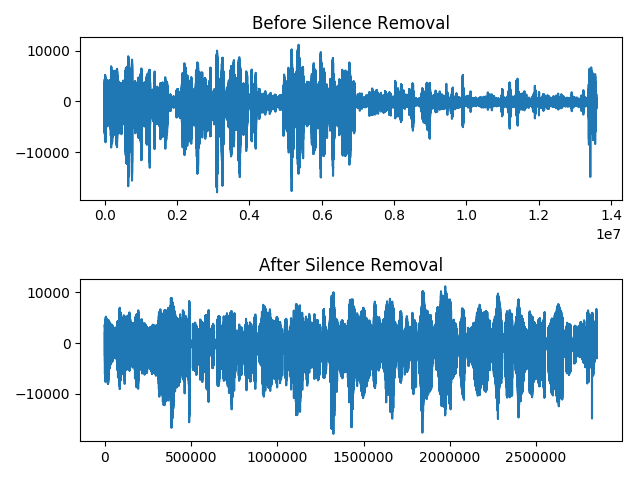

# AudioSegment

[](https://travis-ci.org/MaxStrange/AudioSegment)

Wrapper for [pydub](https://github.com/jiaaro/pydub) AudioSegment objects. An audiosegment.AudioSegment object wraps
a pydub.AudioSegment object. Any methods or properties it has, this also has.

[Docs](https://maxstrange.github.io/AudioSegment/) are hosted by GitHub Pages, but are currently hideous. I've got to do
something about them as soon as I find some time. You can also try [Read The Docs](https://audiosegment.readthedocs.io/en/latest/),
though the docs there don't seem to be building for some reason.... also something I need to look into. Up-to-date docs
are also built and pushed and are in the docs folder of this repository.

## Notes

There is a hidden dependency on the command line program 'sox'. Pip will not install it for you.
You will have to install sox by:

- Debian/Ubuntu: `sudo apt-get install sox`
- Mac OS X: `brew install sox`
- Windows: `choco install sox`

Also, I use [librosa](https://github.com/librosa/librosa) and [scipy](https://www.scipy.org/), for some of the functionality.
These dependencies are hefty, and I have decided to make them optional. If you do not install them, you may get warnings
when using audiosegment.

So, a full installation on Debian/Ubuntu would like like this:

```bash
sudo apt-get install sox
pip3 install --user audiosegment

# To get scipy, you will need some lapack/blas resources:
sudo apt-get install libatlas-base-dev gfortran
pip3 install --user scipy

# To get librosa, you will need numba, which requires LLVMlite, which requires LLVM.
sudo apt-get install llvm
pip3 install --user librosa
```

Make suitable adjustments to fit your own OS's package management system.

## TODO

The following is the list of items I plan on implementing.

- Finish implementing auditory scene analysis (a.k.a blind source separation)
- Add voice-pass filtering and make voice activity detection better
- Add language classification for English and Chinese (and show how to do it for other languages)
- Add more examples to README (especially filterbank)
- Finish removing the SOX dependency

I am open to other suggestions. Open an issue if you have requests, or better yet, if you can do it yourself and open
a pull request, I'll take a look and merge in if I think it makes sense.

## Example Usage

### Basic information

```python
import audiosegment

print("Reading in the wave file...")
seg = audiosegment.from_file("whatever.wav")

print("Information:")
print("Channels:", seg.channels)
print("Bits per sample:", seg.sample_width * 8)
print("Sampling frequency:", seg.frame_rate)
print("Length:", seg.duration_seconds, "seconds")
```

### Voice Detection

```python
# ...
print("Detecting voice...")
seg = seg.resample(sample_rate_Hz=32000, sample_width=2, channels=1)
results = seg.detect_voice()
voiced = [tup[1] for tup in results if tup[0] == 'v']
unvoiced = [tup[1] for tup in results if tup[0] == 'u']

print("Reducing voiced segments to a single wav file 'voiced.wav'")
voiced_segment = voiced[0].reduce(voiced[1:])
voiced_segment.export("voiced.wav", format="WAV")

print("Reducing unvoiced segments to a single wav file 'unvoiced.wav'")
unvoiced_segment = unvoiced[0].reduce(unvoiced[1:])
unvoiced_segment.export("unvoiced.wav", format="WAV")
```

### Silence Removal

```python
import matplotlib.pyplot as plt

# ...
print("Plotting before silence...")
plt.subplot(211)
plt.title("Before Silence Removal")
plt.plot(seg.get_array_of_samples())

seg = seg.filter_silence(duration_s=0.2, threshold_percentage=5.0)
outname_silence = "nosilence.wav"
seg.export(outname_silence, format="wav")

print("Plotting after silence...")
plt.subplot(212)
plt.title("After Silence Removal")

plt.tight_layout()
plt.plot(seg.get_array_of_samples())
plt.show()
```



### FFT

```python
import matplotlib.pyplot as plt
import numpy as np

#...
# Do it just for the first 3 seconds of audio
hist_bins, hist_vals = seg[1:3000].fft()
hist_vals_real_normed = np.abs(hist_vals) / len(hist_vals)
plt.plot(hist_bins / 1000, hist_vals_real_normed)
plt.xlabel("kHz")
plt.ylabel("dB")
plt.show()
```


### Spectrogram

```python
import matplotlib.pyplot as plt

#...
freqs, times, amplitudes = seg.spectrogram(window_length_s=0.03, overlap=0.5)
amplitudes = 10 * np.log10(amplitudes + 1e-9)

# Plot
plt.pcolormesh(times, freqs, amplitudes)
plt.xlabel("Time in Seconds")
plt.ylabel("Frequency in Hz")
plt.show()
```


